#  Slack Meetups

A Slack bot that randomly pairs users in a Slack channel for 1:1 meetups. Meet new, interesting people in your company, club, or group!

## Features

- 💬  Requests a custom introduction for each person
- ❓  Asks availability each round, allowing people to opt in or out of being paired
- 🎲  Randomly pairs people to meet via direct message
- 🤝  Collects feedback on who actually met up
- 🏆  Generates leaderboards and graphs of pairings for each channel

It supports variable frequency and length for rounds of matching, multiple matching "pools" that can operate independently, it and has an admin interface to manage membership, pools, and matching rounds.

## Tech stack

- [Django](https://www.djangoproject.com/) running on Python 3.7+
- SQLite 3 (you can change databases if you need something more robust, but it's not a particularly database-intensive application)
- [Celery](http://www.celeryproject.org/) running on [RabbitMQ](https://www.rabbitmq.com/) as an async task queue for sending messages

**Need to use the Slack [Real-Time Messaging (RTM) API](https://api.slack.com/rtm) instead of the [Events API](https://api.slack.com/events-api)?** Check out the `rtm` branch. You will need to use the RTM API if you're inside a corporate intranet or firewall that won't allow you to receive events from Slack on a publicly accessible URL. The `rtm` branch has a Node.js proxy server under `rtmProxy/` that connects to the socket-based RTM API and forwards events to the Django server. 

The RTM API doesn't support Slack's interactive components like action buttons, so they are replaced with having users just type a "yes"/"no" response to the bot.

## User guide for admins

*Note: This section assumes an already-configured and deployed server. For setup instructions, [see below](#setup-instructions).*

### Add people to a Slack channel

First, get a Slack channel to work with. The bot will automatically message all channel members when you start a new round, so the people in this channel should be at the least aware, and ideally willing to participate. You can use an existing Slack channel or create a new one, but for this reason you may want to have a dedicated channel for the meetup bot.

There is no limit to the number of members who can be in the channel. The more the merrier!

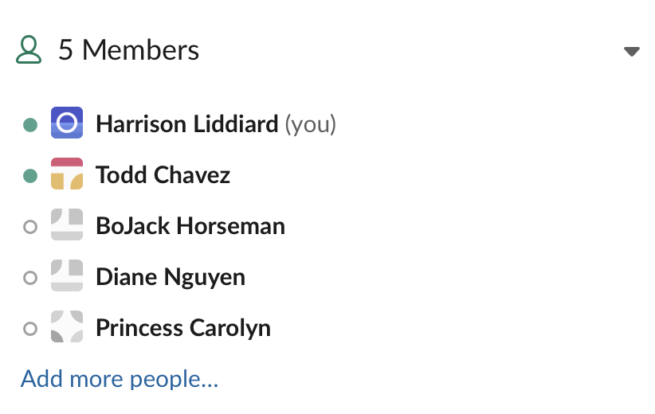

Once you have a channel with some members, you're ready to create a matching pool.

### Create a pool

Log in to the admin interface at `https://<whatever your base url is>/admin/`. The login should look like this:

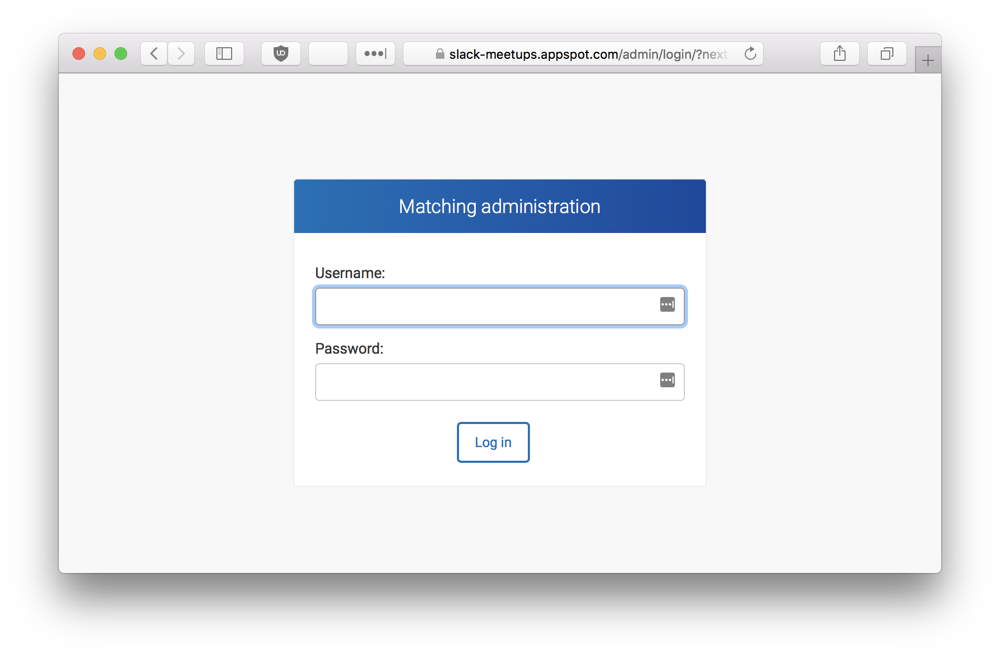

After logging in, you should see the admin dashboard:

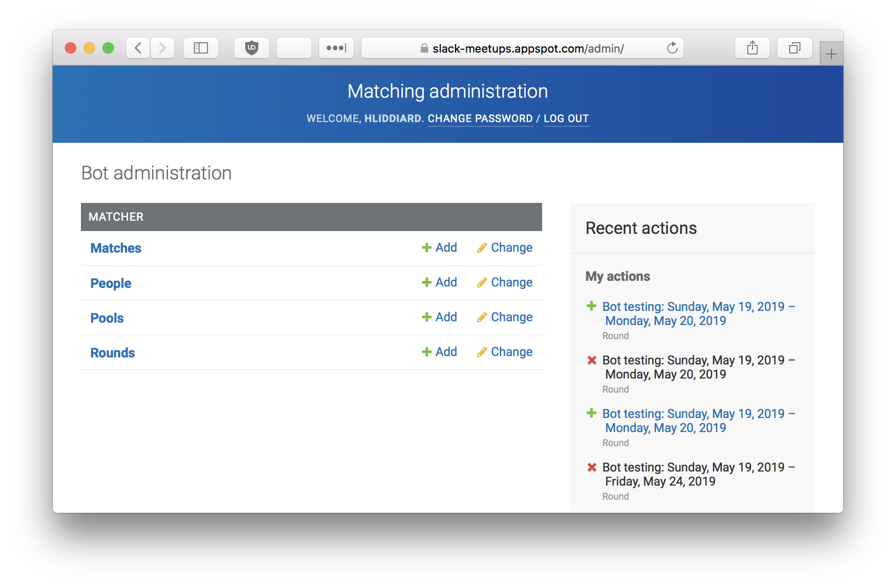

Under the "Matcher" list to the right of "Pools", click the "Add" button. Fill out the info on the page:

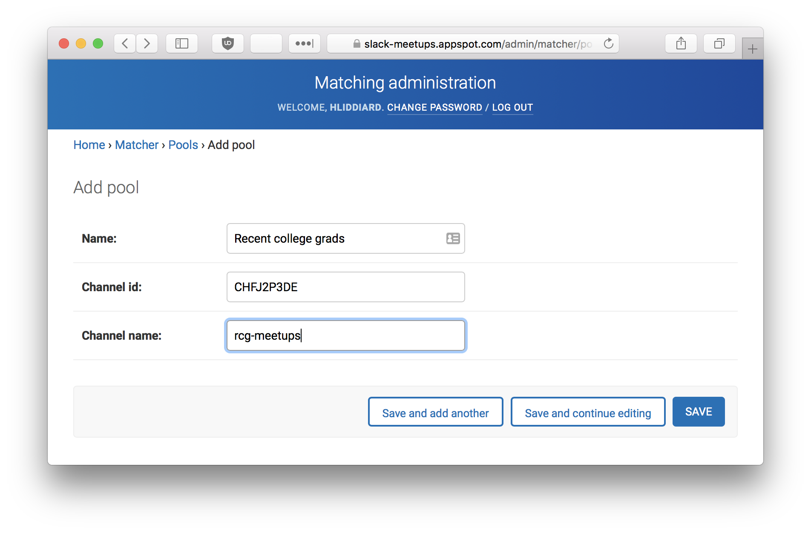

- "Name": a human-readable descriptor for the pool, like “2020 interns”
- "Channel ID": Slack's unique identifier for the channel. You can find this by opening Slack in a web browser, navigating to the channel you want to use, and copying the ID from the URL. See screenshot below.
- "Channel name": The name of the Slack channel. This should match the channel name exactly as it appears in Slack.

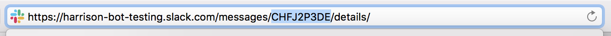

_Example: The Slack channel ID is the highlighted part of the URL._

Finally, click "Save". Your pool is created!

### Start a round of matching

There are two steps to creating a round of matching: asking availability and actually doing the matching. It's often best to do both on Mondays: Ask for people's availability for the round Monday morning, and do the round matching a few hours later after people have had time to respond.

For people who are new to using the bot (which will be everyone on your first round), instead of being asked for availability, they'll be prompted to type a short intro about themselves. When they respond with this intro, they will automatically be marked as available for their first round.

#### Ask for availabilities/intros

Let's see what both scenarios look like by creating a round. Go back to the main page of the admin interface. Under the "Matcher" list to the right of "Rounds", click the "Add" button.

Select a pool and a start and end date. A week is usually good – start on a Monday and end on a Friday. You can set these to whatever you want though!

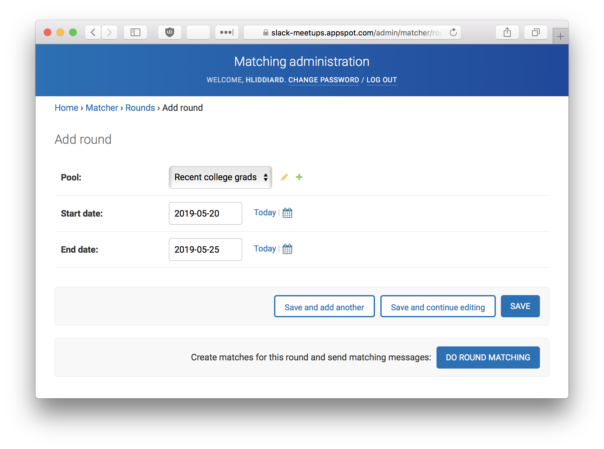

Click the "Save" button. When you do so, everyone in the pool (that is, everyone in the pool's Slack channel) will get a direct message. If they're a first-time user, they'll be asked for an introduction about themselves. Here's how that interaction looks:

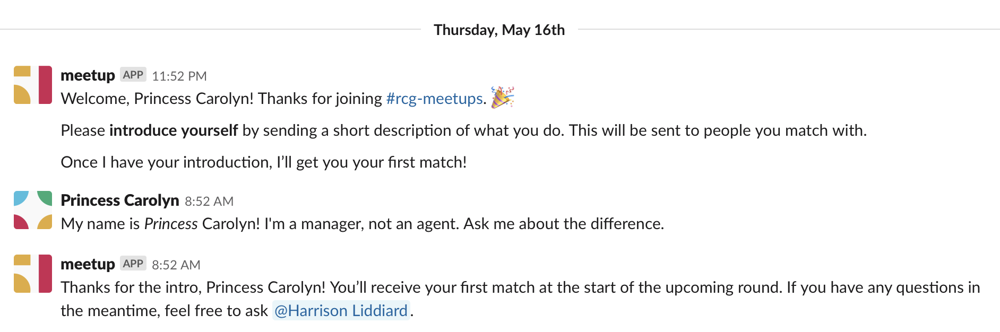

Once they've provided their intro, they're automatically marked as available for their first round. If they never respond with an intro, they'll still appear in the admin interface under "People", but they won't be matched or messaged asking if they're available.

Here's the "People" admin list page:

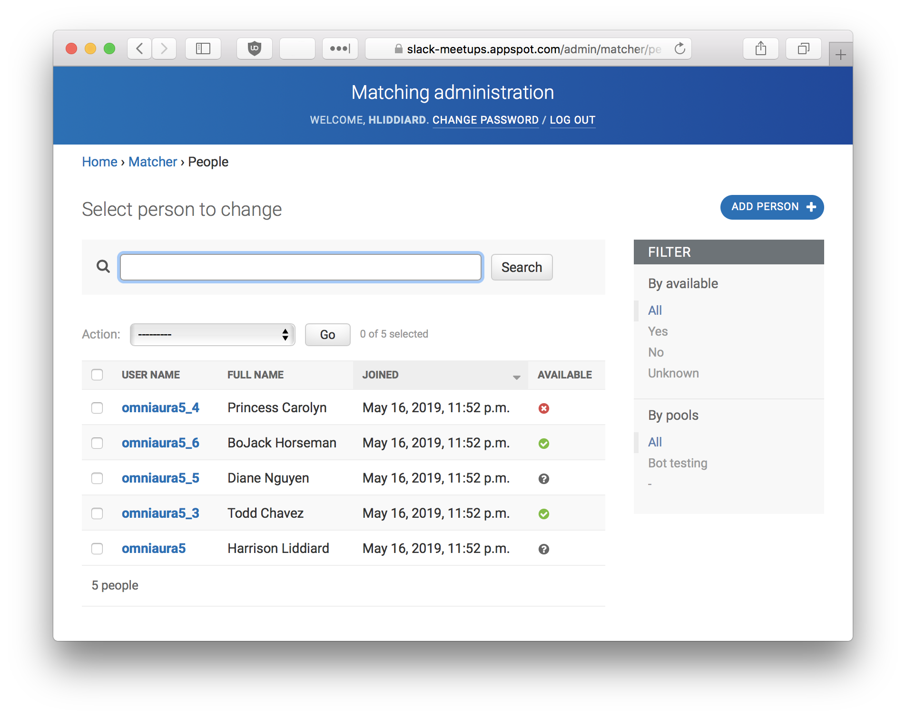

For people who've already provided an intro, they'll get a message asking if they want to be matched in the upcoming round. Their response will update their "available" status:

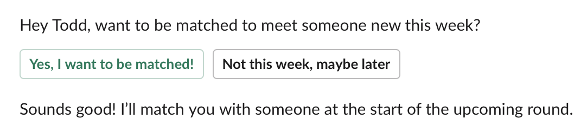

### Do the matching!

Once you've given people enough time to write their intro or update their availability, it's time to start the round! From the admin main page, under the "Matcher" list, click "Rounds". Select the round you created, and at the bottom right, click "Do round matching". People in the pool who've responded as available will be randomly paired up. The bot will create a group DM between the two people and introduce them to each other:

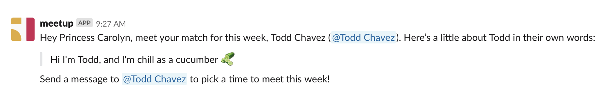

You can see who was matched by going to the admin interface, and under "Matcher" click "Matches". It's not advisable to change matches after they're made because the bot will not automatically re-message people. It's also just confusing for participants.

### Find out who met up

When the current round is over and you're ready to start a new one, follow the same instructions above under "Start a round of matching". The bot will still solicit everyone's availability, but this time after each user RSVPs, the bot will check if this person met with someone before. If so, it will send a follow-up message asking if they met up with their previous match. Here's what that looks like:

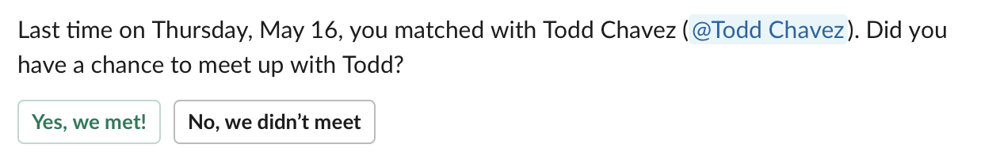

From the admin interface, under "Matcher" you can click "Matches" to see a full list of matches. You can filter by round and "met" status to get stats on how many people met up from each round.

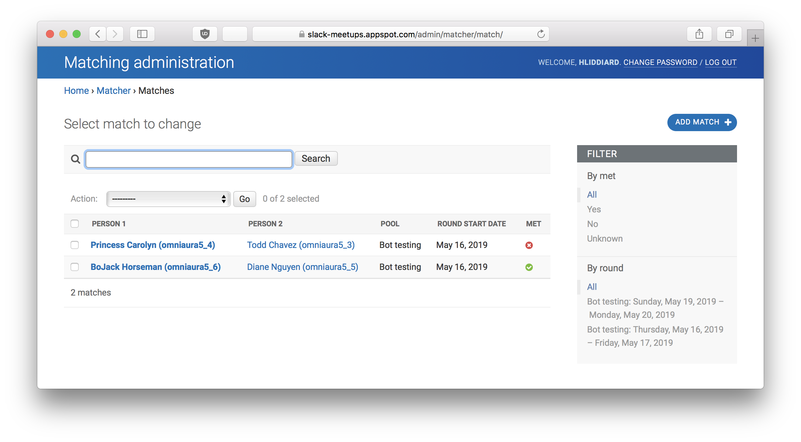

### View and share the stats page

After you've completed a few rounds of pairing, you might want to take a look at the stats page. Stats pages are automatically generated for each pool and can be found at `<your base url>/stats/<channel-name>`. They display general numerical statistics about the pool, a leaderboard of who has met up with the most people, and a graph showing all pairings. Example screenshots below.

#### Leaderboard

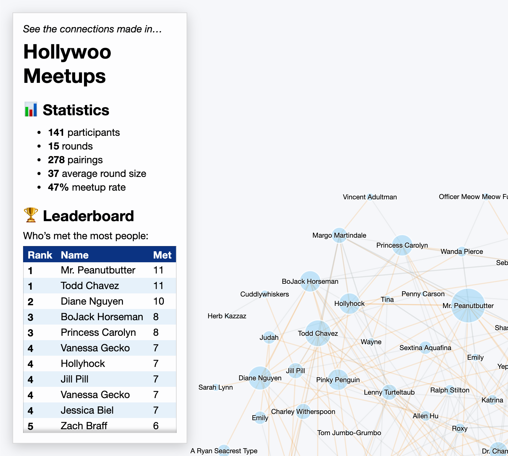

#### Pairings graph, with one person and their pairings highlighted

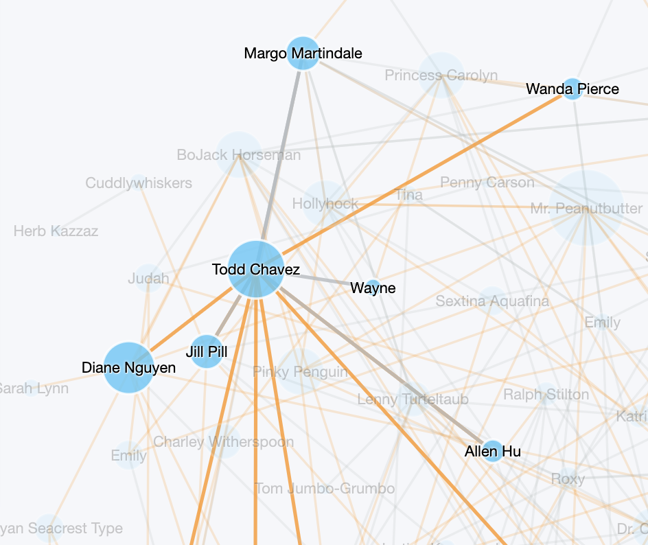

## Known limitations

- The bot's message content is a bit specific in places and may not match your use case. Luckily, all content is stored within `matcher/messages.py` so it's fairly easy to customize if you want to fork the repo.
- The bot doesn't respond to text queries, other than to set a person's intro. Aside from that, it will repond with a generic "Sorry, I don't know how to respond!" type of message unless an admin is configured in the `ADMIN_SLACK_USER_ID` environment variable (see "Configuring the web server" section below). If an admin is defined, they will get a DM with "unknown" queries to the bot and have ability to respond to them as the bot.
- Setting up automated, scheduled matching rounds must be done from the `cron-jobs` file. There is not an admin UI for doing so.
- On the admin side, there's not a ton of input validation, and there are no pool-specific admin permissions. The app mostly assumes that admins know what they're doing. If they do something wrong or unusual (like using a non-existent ID for a Slack channel, creating a matching round in the past, etc), unexpected behavior is likely to happen. That said, most of the error-prone tasks are in creating pools (generally an infrequent or one-time thing) and editing matches (which is inadvisable anyway). Using Django's built-in user groups, you can restrict admin users' ability to edit these models.

## Setup instructions

### Slack API

#### Create the app

1. Create a Slack app under your desired workspace at [https://api.slack.com/apps/](https://api.slack.com/apps/).
2. Under Features > App Home > Show Tabs, **check** the checkbox "Allow users to send Slash commands and messages from the messages tab".
3. Under Settings > Basic Information > Display Information, set your app name and description as desired. I recommend using the [cute bot logo](graphics/bot_logo.png).

#### Enable interactivity

1. Under Settings > Basic Information > Building Apps for Slack > Add features and functionality, click **Interactive Components**.
2. Toggle Interactivity to **ON**.
3. Enter a base **Request URL**, appended with `/slack/action/`. This URL needs to be publicly accessible, so for local development I recommend using [ngrok](https://ngrok.com/) or [localhost.run](https://localhost.run/).
4. **Save Changes**.

#### Enable events

1. Under Settings > Basic Information > Building Apps for Slack > Add features and functionality, click **Event Subscriptions**.
2. Toggle Enable Events to **ON**.
3. Enter the same base **Request URL** as above, appended with `/slack/message/`.
4. Under Subscribe to bot events, click **Add Bot User Event** and add the following events:
  - `message.im`
  - `message.mpim`
  - `app_mention`
5. **Save Changes**.

#### Set up OAuth

1. Go to Settings > Basic Information > Building Apps for Slack > Add features and functionality and click **Bots**.
2. Click **Review Scopes to Add**.
3. Under Scopes > Bot Token Scopes, click **Add an OAuth Scope**.
4. Add the following scopes:
  - `users:read`
  - `users:read.email`
  - `users.profile:read`
  - `channels:read`
  - `groups:read`
  - `im:read`
  - `im:history`
  - `im:write`
  - `mpim:read`
  - `mpim:history`
  - `mpim:write`
  - `channels:manage`
  - `app_mentions:read`
  - `groups:write`
  - `chat:write`
5. Under OAuth Tokens for Your Workspace, click **Install to Workspace**.
6. Review and confirm the installation.
7. You should now see your Bot User OAuth Token. This token allows the bot to access the Slack workspace. It usually starts with "xoxb-", and it corresponds to the `SLACK_API_TOKEN` value referenced in the "Configuring the web server" section below. 
8. Copy it and store it securely.

#### Get the signing secret

1. Under Settings > Basic Information > App Credentials, **Show** the Signing Secret. This key allows the bot (the web server you will set up below) to verify that the incoming request is actually coming from Slack. It corresponds to the `SLACK_SIGNING_SECRET` value referenced below. 
2. Copy it and store it securely.

### Environment variable setup

1. In the top level of the repo, run `cp .env.example .env`
2. Edit the `.env` example to fill in environment variables, including:
  - `SECRET_KEY`: required; a long random string for Django's cryptography
  - `SLACK_API_TOKEN`: required; a bot token to connect to Slack, usually starts with "xoxb-"
  - `SLACK_SIGNING_SECRET`: required; used to verify that requests are from Slack
  - `ADMIN_SLACK_USER_ID`: optional; Slack user ID for the admin who will be messaged if the bot receives a message it doesn't know how to act on

### Running with Docker (recommended)

1. [Install Docker](https://docs.docker.com/get-docker/)
2. Run `docker compose up` (add `-d` to run in the background)

### Running without Docker

*You can ignore this section if you're using the Docker-based setup.*

#### Prerequisites

- Ensure you have Python 3.7+ installed
- Install [RabbitMQ](https://www.rabbitmq.com/download.html)

#### Installation

1. create a virtualenv folder: `mkdir meetups`
2. [install the virtualenv](https://docs.python.org/3/library/venv.html): `python3 -m venv meetups`
3. `cd meetups`, `source bin/activate`
4. clone repo into the virtualenv
5. `cd [repo]`
6. `pip3 install -r requirements.txt`

#### Configuring the web server

1. `python manage.py collectstatic` to move static files for serving
2. `python manage.py makemigrations matcher` to set up migrations to create the database tables
3. `python manage.py migrate` to create the database tables
4. `python manage.py createsuperuser` to create your user to log in to the admin
5. Start the server! In development this will be `python3 manage.py runserver`. In production this might be `gunicorn meetups.wsgi`.
6. Log in to the admin and follow the steps above to set up a matching pool. The admin URL is `<your base url>:<port number>/admin/`.

#### Configuring the Celery task queue

In order to send Slack messages from the bot, you also need to run a Celery task queue. This queue allows the bot to send messages asyncronously and retry if sending fails, which can happen if there are network issues or the bot gets rate-limited by the Slack API.

After installing RabbitMQ (see Setup above), do the following:

1. Start the RabbitMQ broker. How to do this varies by OS and installation method; see the [RabbitMQ docs](https://www.rabbitmq.com/docs/download).
2. In a separate terminal window, again source the virtualenv with the command `source bin/activate` (or whatever the path to the `activate` script is)
3. Start the Celery task queue: `celery -A matcher.tasks worker --loglevel=info`

## Setup for production deployment

I recommend using Docker for production deployment, following similar instructions as above. In the `.env` file, make sure you also have `DEBUG=False` for security.

In production, you should run the app behind a proxy server. I recommend Nginx. Here's an example config:

```Nginx
server {
    listen 80;

    server_name yourdomain.com;

    location / {
        proxy_pass http://localhost:8000;
        proxy_set_header Host $host;
        proxy_set_header X-Real-IP $remote_addr;
        proxy_set_header X-Forwarded-For $proxy_add_x_forwarded_for;
        proxy_set_header X-Forwarded-Proto $scheme;
    }
}
```

## Scheduled matching rounds

If you want to do recurring matching rounds in a Slack channel and don't want to have to manually log into the admin and press buttons to do it every time, follow these instructions:

1. After creating a matching pool (see User Guide above), open the `cron-jobs` file at the top of the repo.
2. Uncomment the lines containing `create_round` (for automated round creation – asking availability), and `do_round_matching` (to make 1:1 matches after people have had time to respond).
3. Set the schedule on which you want each of these things to happen using [cron syntax](https://crontab.guru/#0_10_*_*_1), such as `0 10 * * 1` for 10:00am (server time) every Monday.
4. Replace the example channel ID (`C07AA3ZH0Q5`) with the one from your matching pool. You can also provide multiple channel IDs separated by spaces.
5. Save the file.
6. Rebuild and restart the Docker container.

### `rtm` branch considerations

The real-time messaging branch also requires a Node.js proxy server to forward the socket-based requests to Django over HTTP. You can modify the `docker-compose.yml` to add a Node service there, or run it manually:

```shell
cd meetups; source bin/activate; cd repo/rtmProxy
npm install
npm start
```

---

_This Slack bot is in no way endorsed by or affiliated with Slack Technologies or their product, Slack._
